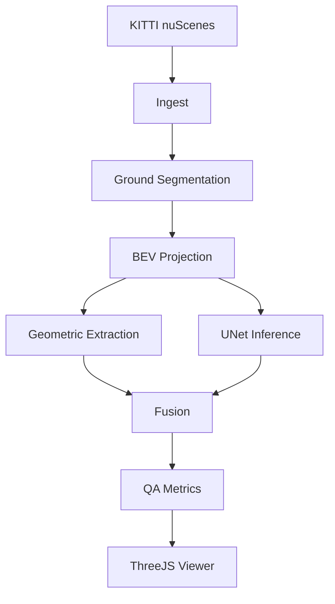

# HD Map Feature Extraction Pipeline

LiDAR mapping pipeline that converts raw autonomous vehicle point clouds into lane-boundary map features.

The system ingests LiDAR scans and vehicle poses, accumulates them into a global ENU frame, separates ground from obstacles, projects road-surface returns into a Bird's Eye View (BEV) representation, extracts lane-boundary polylines using geometric and neural methods, evaluates results against ground truth, and visualizes the full workflow in a Three.js inspection tool.

## Motivation

Modern HD maps are built from large-scale LiDAR surveys. Before map features are able to be validated by humans, raw point clouds must be (1) localized into a common world frame, (2) filtered and segmented, (3) converted into semantic map primitives, and (4) evaluated against reference maps.

This project implements a basic version of this workflow, with a focus on lane-boundary extraction and map QA.

## Overview

Given raw LiDAR + vehicle poses, this system:

1. Aligns all scans into a global ENU frame
2. Filters ground points using RANSAC plane fitting
3. Builds a BEV raster of road surface intensity
4. Extracts lane boundaries via:
   - geometric clustering (DBSCAN + RDP)
   - neural segmentation (U-Net)
5. Fuses outputs into world-frame lane polylines
6. Evaluates against ground truth (distance + completeness metrics)
7. Visualizes results in an interactive WebGL viewer

**Output:** GeoJSON lane polylines + QA metrics + rendered 3D scene

---

## Pipeline

### Stage 1: Ingest

Transforms LiDAR frames into a global ENU coordinate system using GPS/IMU poses and sensor calibration parameters. Outputs are stored as Parquet point clouds.

### Stage 2: Filter

Separates road-surface points from obstacles using seed-constrained RANSAC plane fitting.

Key design choice: RANSAC is initialized on a restricted height band around the ego vehicle, preventing vertical structures (e.g., walls, facades) from dominating plane estimation in dense urban scenes.

### Stage 3: BEV Projection

Projects ground-classified points into a top-down intensity image at 5 cm/pixel resolution using per-scan intensity normalization.

This per-frame normalization avoids sensor- and weather-dependent intensity bias (e.g., wet vs. dry pavement), improving consistency of lane-marking visibility across scenes.

### Stage 4: Feature Extraction

Lane boundaries are extracted via two parallel paths:

- **Geometric path:** High-intensity ground pixels are clustered using DBSCAN in world-frame XY coordinates (not BEV pixel space), then converted into polylines using Ramer–Douglas–Peucker simplification.
- **Neural path:** A lightweight U-Net operating on BEV imagery produces lane predictions that are back-projected into world coordinates.

Key design choice: clustering is performed in world space to avoid BEV projection artifacts that can merge adjacent lane structures at high curvature or tight intersections.

Outputs are fused into a single set of lane-boundary polylines in ENU coordinates.

### Stage 5: QA

Extracted features are evaluated against reference annotations using:

- Completeness (fraction of ground-truth features matched within tolerance)
- Hausdorff distance (P50 / P95 positional error)
- False-positive rate
- Classification accuracy

---

## Architecture



### Module structure

```text
src/
  geometry/    # SE3 rigid body transforms, RDP polyline simplification,
                 Hausdorff distance. No internal imports. Everything else
                 depends on this layer.
  data/        # KITTI (.bin + oxts + calib) and nuScenes parsers.
                 Outputs SE3 poses and (N,4) float32 point arrays.
  filters/     # Voxel grid (C++ pybind11), radius outlier removal,
                 RANSAC ground plane separation.
  ml/          # BEVSegNet U-Net, training loop, batch inference +
                 back-projection to 3D world coordinates.
  pipeline/    # Ingest, BEV projection, lane extraction, QA, fusion.
                 Stages communicate through Parquet and GeoJSON files.
  viz/         # Standalone Three.js application. Reads GeoJSON and
                 binary point cloud files. No Python imports.
```

---

## Quick Start

```bash
python3 -m venv .venv
source .venv/bin/activate
pip install -r requirements-dev.txt
pytest tests/ -v
python scripts/run_pipeline.py --config configs/default.yaml --stage full --output data/outputs
cd src/viz && npm install && npm run dev -- --host 0.0.0.0
```

Open `http://localhost:5173` for the viewer.

**Docker (runs full pipeline + viewer in one command):**

```bash
docker compose up pipeline --build --abort-on-container-exit
docker compose up -d viz --build
```

Open `http://localhost:5173/?benchmark=1` for the 500K-point benchmark scene.

---

## Dataset Setup

**KITTI Raw** - download only the sequences needed:

```text
http://www.cvlibs.net/datasets/kitti/raw_data.php
  -> 2011_09_26_drive_0005_sync  (velodyne_points, oxts)
  -> 2011_09_26_drive_0009_sync  (velodyne_points, oxts)
  -> 2011_09_26_calib
```

**nuScenes** - v1.0-mini is sufficient for training data preparation:

```text
https://www.nuscenes.org/nuscenes
  -> v1.0-mini
```

Expected layout:

```text
data/raw/kitti/2011_09_26_drive_0005_sync/
data/raw/kitti/2011_09_26_calib/
data/raw/nuscenes_mini/
```

Run preprocessing once per scene (idempotent, content-addressed caching):

```bash
python scripts/preprocess_kitti.py \
    --scene data/raw/kitti/2011_09_26_drive_0005_sync \
    --calib data/raw/kitti/2011_09_26_calib \
    --output data/processed/kitti_0005 \
    --n_frames 50

python scripts/prepare_nuscenes_training.py \
    --nuscenes data/raw/nuscenes_mini \
    --output data/processed/nuscenes_mini
```

---

## Results

The pipeline produces structured lane-boundary map features from raw LiDAR sequences and exports them as world-frame geometric primitives suitable for downstream HD map construction and QA workflows.

Outputs include:

- World-frame point clouds (ENU)
- Lane-boundary polylines (GeoJSON)
- QA evaluation metrics
- Interactive visualization in Three.js

Tested on Apple Silicon, macOS.

| Stage | Target | Result | Status |
|---|---|---|---|
| Voxel downsample (C++ pybind11, 200K pts -> 20K voxels) | < 80 ms | **32.98 ms** | ✓ |
| NumPy voxel fallback | — | 70.63 ms | — |
| Three.js viewer, 500K points, GPU Chrome | ≥ 30 fps | **60.66 FPS** | ✓ |
| Color mode switch | < 50 ms | < 1 ms (buffer update only) | ✓ |

See `docs/benchmarks.md` for full timing tables and methodology.

The C++ extension is a pybind11 voxel grid that sorts points into spatial bins using integer key hashing, achieving 2.14× speedup over the NumPy fallback. The fallback remains available if the extension fails to build.

---

## Testing

```bash
pytest tests/ -v
```

Coverage includes geometry, data ingestion, ground segmentation, BEV generation, feature extraction, QA metrics, ML inference, and visualization.

```text
tests/
  geometry/     # SE3 round-trip, RDP simplification, Hausdorff distance
  filters/      # RANSAC synthetic plane, seed-set isolation, voxel grid
  pipeline/     # BEV pixel location, lane extraction, QA edge cases
  ml/           # U-Net forward pass, parameter count, training convergence
  data/         # KITTI parser schema, nuScenes annotation alignment
  viz/          # Viewer benchmark mode, FPS metrics, headless script
```

---

## Limitations

- Single-plane RANSAC struggles on strongly banked roads.
- Intensity thresholding remains sensitive to adverse weather.
- Cross-dataset evaluation requires trained model weights and real data.
- Large-scale survey routes are not yet streamed or tiled.
- The GitHub Pages deployment serves precomputed outputs only.

