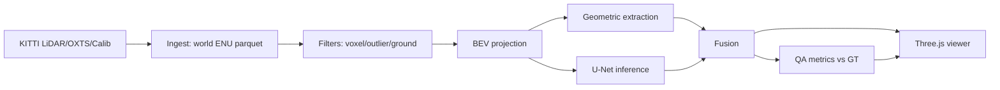

# HD Map Feature Extraction Pipeline

A production-oriented LiDAR feature extraction pipeline for autonomous vehicle HD mapping. Ingests raw point cloud frames, transforms them into a unified ENU world frame, separates ground from obstacles via RANSAC with seed-set pre-filtering, projects ground returns into a Bird's Eye View intensity image, extracts lane boundary polylines through DBSCAN clustering, scores them against ground truth with completeness and false-positive metrics, and renders everything in an interactive Three.js inspection viewer.

Built to demonstrate fit for day-to-day AV mapping infrastructure work: data pipelines over sensor data, automation algorithms for feature extraction, QA tooling for map validation, and ML integration on spatial datasets.

**Live demo:** after pushing to GitHub, enable Pages (`Settings → Pages → Source: GitHub Actions`). The viewer deploys automatically on every push to `main` and is available at `https://<your-username>.github.io/hd-map-pipeline/` — no server required.

---

## Quick Start

```bash
python3 -m venv .venv
source .venv/bin/activate
pip install -r requirements-dev.txt
pytest tests/ -v
python scripts/run_pipeline.py --config configs/default.yaml --stage full --output data/outputs
cd src/viz && npm install && npm run dev -- --host 0.0.0.0
```

Open `http://localhost:5173` for the viewer.

**Docker (runs full pipeline + viewer in one command):**

```bash
docker compose up pipeline --build --abort-on-container-exit
docker compose up -d viz --build
```

Open `http://localhost:5173/?benchmark=1` for the 500K-point benchmark scene.

---

## Architecture



### Module structure

```
src/
  geometry/    — SE3 rigid body transforms, RDP polyline simplification,
                 Hausdorff distance. No internal imports. Everything else
                 depends on this layer.
  data/        — KITTI (.bin + oxts + calib) and nuScenes parsers.
                 Outputs SE3 poses and (N,4) float32 point arrays.
  filters/     — Voxel grid (C++ pybind11), radius outlier removal,
                 RANSAC ground plane separation.
  ml/          — BEVSegNet U-Net, training loop, batch inference +
                 back-projection to 3D world coordinates.
  pipeline/    — Ingest, BEV projection, lane extraction, QA, fusion.
                 Stages communicate through Parquet and GeoJSON files.
  viz/         — Standalone Three.js application. Reads GeoJSON and
                 binary point cloud files. No Python imports.
```

All numeric parameters live in `configs/*.yaml` — no magic numbers in source.

---

## Pipeline Stages

### Stage 1 — Ingest

Loads KITTI `.bin` LiDAR frames, parses GPS/IMU poses as SE3 transforms, applies the vehicle→sensor calibration matrix from `calib/`, and accumulates N frames into a single point cloud in the ENU world frame. Output: `accumulated.parquet` with columns `x, y, z, intensity, timestamp, frame_id` (all spatial columns float32).

### Stage 2 — Filter

**Voxel downsample:** C++ pybind11 extension, 5 cm voxel grid. 2.14× faster than the NumPy fallback (32.98 ms vs 70.63 ms for 200K points). Radius outlier removal removes isolated points from sparse scan edges.

**Ground separation (RANSAC):** Seed-set pre-filtering restricts the initial candidate pool to points within a height band above the vehicle (z ∈ [−0.5, 0.8] m in vehicle frame, configurable). RANSAC fits a plane to the seed set, then refines inlier classification over the full cloud. Without seed pre-filtering, RANSAC frequently fits walls or building facades on urban scenes — the seed set forces the initial plane into the ground region before RANSAC runs.

### Stage 3 — BEV Projection

Projects ground-classified points into a top-down intensity image at 5 cm/pixel resolution. Normalization is **per-scan**: each frame divides by its own maximum intensity rather than a global constant. This ensures consistent lane marking detection across different LiDAR sensors and weather conditions (wet pavement attenuates returns differently than dry).

### Stage 4 — Feature Extraction

High-intensity ground pixels are back-projected to 3D and clustered with DBSCAN in world-frame XY coordinates (not pixel space — this prevents merging nearby parallel lanes that appear connected in the BEV image at tight corners). Clusters are fit with polylines and simplified via Ramer–Douglas–Peucker. Output: `features.geojson` with world-frame ENU coordinates.

A lightweight U-Net (BEVSegNet, ~2M parameters) trained on nuScenes-mini BEV images provides a second detection path. Predictions are back-projected to 3D via the inverse BEV transform and fused with geometric detections. The model is **trained on nuScenes, evaluated on KITTI** — cross-dataset to demonstrate generalization rather than overfitting to the training distribution.

### Stage 5 — QA

Compares extracted features against ground truth annotations (nuScenes map layer or manually annotated KITTI reference). Metrics:

| Metric | Definition |
|---|---|
| Completeness | Fraction of GT features matched by a prediction within a distance threshold |
| Positional accuracy P50/P95 | Median and 95th-percentile Hausdorff distance between matched pairs |
| False positive rate | Fraction of predictions with no GT match |
| Classification accuracy | Per-class label agreement on matched pairs |

---

## Three.js Viewer

The viewer is modeled after internal AV map QA tooling: dark background, system-ui font, no decorative chrome. It lets an engineer inspect extracted features against the point cloud, switch between individual scan frames (raw / ground / obstacle splits), and compare what the pipeline sees against a top-down LiDAR intensity image.

### Frame and Stage Selector

The sidebar **Scene** section selects which point cloud to display:

- **Frame 0–4**: individual KITTI frames transformed to world ENU, ~122K points each
- **Accumulated**: all frames merged into a single cloud (~610K points)

The **Stage** section (disabled for Accumulated) selects the pipeline split:

- **Raw**: full Velodyne HDL-64E scan (road surface + vehicles + buildings)
- **Ground**: RANSAC inliers — road surface and lane markings
- **Obstacles**: non-ground returns — vehicles, pedestrians, vegetation

### Keyboard Shortcuts

| Key | Action |
|---|---|
| `1` | Toggle point cloud visibility |
| `2` | Toggle feature line overlay |
| `3` | Toggle QA annotation overlay |
| `I` | Point cloud color: intensity (turbo colormap) |
| `H` | Point cloud color: height (turbo colormap) |
| `V` | Toggle perspective / BEV top-down orthographic |
| `B` | Toggle BEV intensity image panel (80 m × 80 m, 5 cm/px) |
| `R` | Reset camera to scene center |
| Click | Select feature line — shows type, confidence, source, vertex count in sidebar |
| Drag | Orbit (perspective) / pan (BEV) |
| Scroll | Zoom |

### BEV Image Panel

Press `B` or click **BEV image** in the sidebar to open a floating 300×300 px panel showing the Bird's Eye View intensity projection for the selected frame. The panel updates automatically when you switch frames. The image is the direct input to the lane extraction stage — bright horizontal streaks are lane markings.

### Performance

500K points at **60.66 FPS** in GPU-backed Chrome via `THREE.BufferGeometry` with `Float32Array` typed arrays. Color mode switches update the vertex color buffer attribute in place — no geometry rebuild required (`< 1 ms` per switch).

**QA overlays:** False positive features render in amber (`#f59e0b`), missed GT features in red (`#ef4444`), matching the color convention used in production map QA dashboards.

---

## GitHub Pages Deployment

The viewer builds to `docs/` and deploys automatically on every push to `main` via GitHub Actions (`.github/workflows/deploy.yml`). To enable:

1. Push to GitHub
2. Go to `Settings → Pages → Source: GitHub Actions`
3. The next push to `main` triggers a deploy

The deployed viewer includes all pre-computed pipeline outputs (point cloud frames, BEV images, extracted features, QA report). The **Run Pipeline** button requires a running API server and will show an error message on the static Pages deployment — this is expected.

---

## Dataset Setup

**KITTI Raw** — download only the sequences needed:

```text
http://www.cvlibs.net/datasets/kitti/raw_data.php
  → 2011_09_26_drive_0005_sync  (velodyne_points, oxts)
  → 2011_09_26_drive_0009_sync  (velodyne_points, oxts)
  → 2011_09_26_calib
```

**nuScenes** — v1.0-mini is sufficient for training data preparation:

```text
https://www.nuscenes.org/nuscenes
  → v1.0-mini
```

Expected layout:

```text
data/raw/kitti/2011_09_26_drive_0005_sync/
data/raw/kitti/2011_09_26_calib/
data/raw/nuscenes_mini/
```

Run preprocessing once per scene (idempotent, content-addressed caching):

```bash
python scripts/preprocess_kitti.py \
    --scene data/raw/kitti/2011_09_26_drive_0005_sync \
    --calib data/raw/kitti/2011_09_26_calib \
    --output data/processed/kitti_0005 \
    --n_frames 50

python scripts/prepare_nuscenes_training.py \
    --nuscenes data/raw/nuscenes_mini \
    --output data/processed/nuscenes_mini
```

---

## Benchmarks

Hardware: Apple Silicon (`arm64`), macOS.

| Stage | Target | Result | Status |
|---|---|---|---|
| Voxel downsample (C++ pybind11, 200K pts → 20K voxels) | < 80 ms | **32.98 ms** | ✓ |
| NumPy voxel fallback | — | 70.63 ms | — |
| Three.js viewer, 500K points, GPU Chrome | ≥ 30 fps | **60.66 FPS** | ✓ |
| Color mode switch | < 50 ms | < 1 ms (buffer update only) | ✓ |

See `docs/benchmarks.md` for full timing tables and methodology.

The C++ extension is a pybind11 voxel grid that sorts points into spatial bins using integer key hashing, achieving 2.14× speedup over the NumPy fallback. The fallback remains available if the extension fails to build.

---

## Testing

```bash
pytest tests/ -v
```

63 tests across geometry, filters, pipeline, ML, and visualization. Tests run entirely on synthetic fixtures — no downloaded datasets required. Cross-dataset evaluation (nuScenes→KITTI) is exercised in `tests/ml/`.

```
tests/
  geometry/     — SE3 round-trip, RDP simplification, Hausdorff distance
  filters/      — RANSAC synthetic plane, seed-set isolation, voxel grid
  pipeline/     — BEV pixel location, lane extraction, QA edge cases
  ml/           — U-Net forward pass, parameter count, training convergence
  data/         — KITTI parser schema, nuScenes annotation alignment
  viz/          — Viewer benchmark mode, FPS metrics, headless script
```

---

## Known Limitations

- **Banked roads:** RANSAC fits a single plane per accumulated segment. Roads with > 5° cross-slope (banked turns, ramps) cause the fitted plane to tilt, misclassifying some road surface points as obstacles. Production systems use a terrain model or multi-plane fitting.
- **Rain / wet pavement:** Intensity-percentile thresholding adapts to overall scan brightness but cannot distinguish specular water returns from lane markings. A learned threshold or multi-return fusion is needed for adverse weather.
- **BEV annotation rasterization:** nuScenes training masks rasterize annotation polygon vertices rather than filling thick lane polygons. This underrepresents wide road markings at training time.
- **U-Net evaluation:** Cross-dataset smoke evaluation is synthetic unless real KITTI data and trained model weights are present.
- **OXTS stub data:** The included KITTI 0005 frames use constant GPS coordinates (lat=49.0, lon=8.0) — the vehicle does not move between frames in world ENU. Individual frame views show real sensor geometry; the Accumulated view shows all frames co-located at the origin.
- **Run Pipeline on Pages:** The static GitHub Pages deployment cannot reach the Python API server. Clicking "Run Pipeline" will report "could not reach API server" — this is expected. The pre-computed pipeline outputs are served as static files.
- **Viewer benchmark:** The 500K-point scene uses a synthetic world-frame cloud. Real KITTI scene FPS should be re-measured after loading full survey data — memory layout differs between synthetic grid and real scan patterns.
