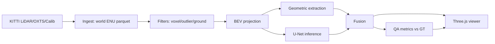

# HD Map Feature Extraction Pipeline

Production-oriented HD map feature extraction pipeline for LiDAR point clouds. It ingests KITTI-style frames, transforms them into local world ENU, filters and extracts lane-boundary features, computes QA metrics against ground truth, and renders point clouds plus overlays in a Three.js inspection viewer.

## Quick Start

```bash
python3 -m venv .venv
source .venv/bin/activate
pip install -r requirements-dev.txt
pytest tests/ -v
python scripts/run_pipeline.py --config configs/default.yaml --stage full --output data/outputs
cd src/viz
npm install
npm run dev -- --host 0.0.0.0
```

Open `http://localhost:5173` for the viewer.

## Dataset Setup

KITTI Raw: download only `2011_09_26_drive_0005`, `2011_09_26_drive_0009`, and `2011_09_26_calib` from `http://www.cvlibs.net/datasets/kitti/raw_data.php`.

nuScenes: download `v1.0-mini` from `https://www.nuscenes.org/nuscenes`.

Expected layout:

```text
data/raw/kitti/2011_09_26_drive_0005_sync/
data/raw/kitti/2011_09_26_calib/
data/raw/nuscenes_mini/
```

## Architecture



## Benchmarks

See `docs/benchmarks.md`. Current voxel downsample benchmark: C++ pybind11 mean `32.98 ms` for 200,000 points into 20,000 occupied voxels.

## Docker

```bash
docker compose -f docker/docker-compose.yml up pipeline
docker compose -f docker/docker-compose.yml up viz
```

## Known Limitations

- RANSAC fits one plane per frame and can fail on banked roads, ramps, or overpasses.
- BEV mask preparation rasterizes annotation vertices rather than thick lane polygons.
- U-Net smoke evaluation is synthetic unless real KITTI and model weights are supplied.
- Viewer performance still needs browser DevTools measurement on real 500K-point scenes.

